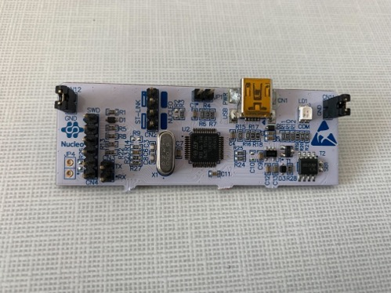
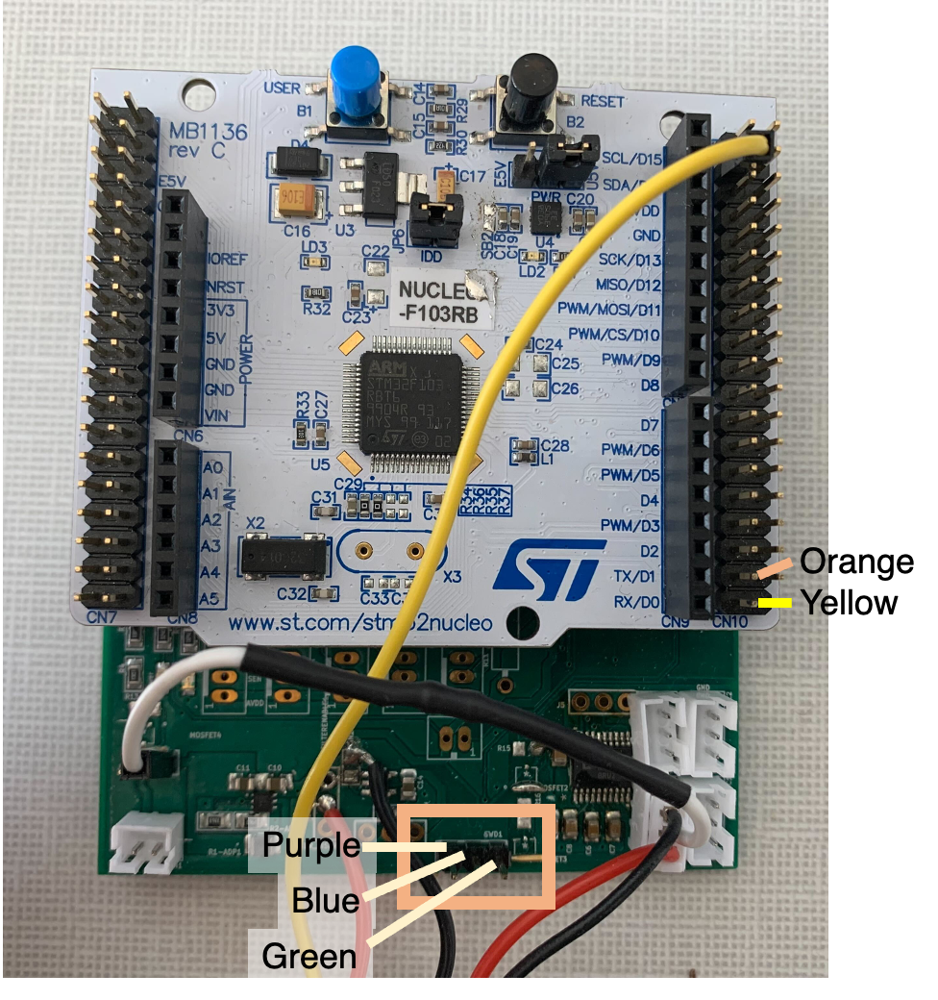
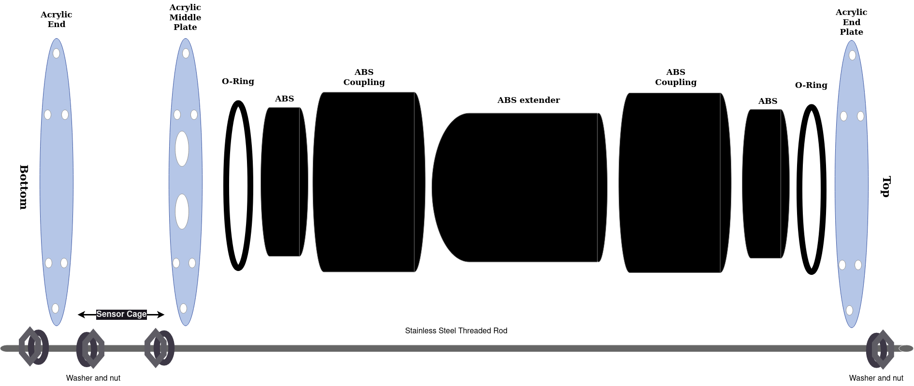
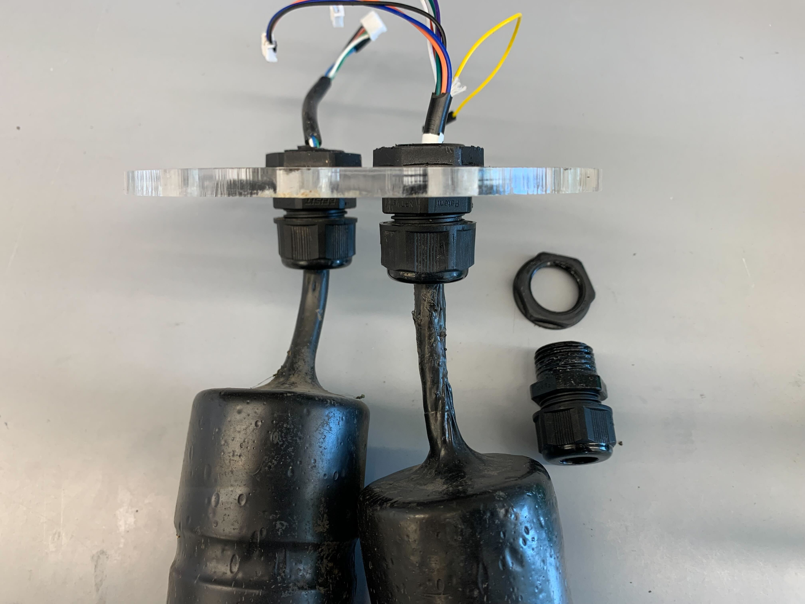
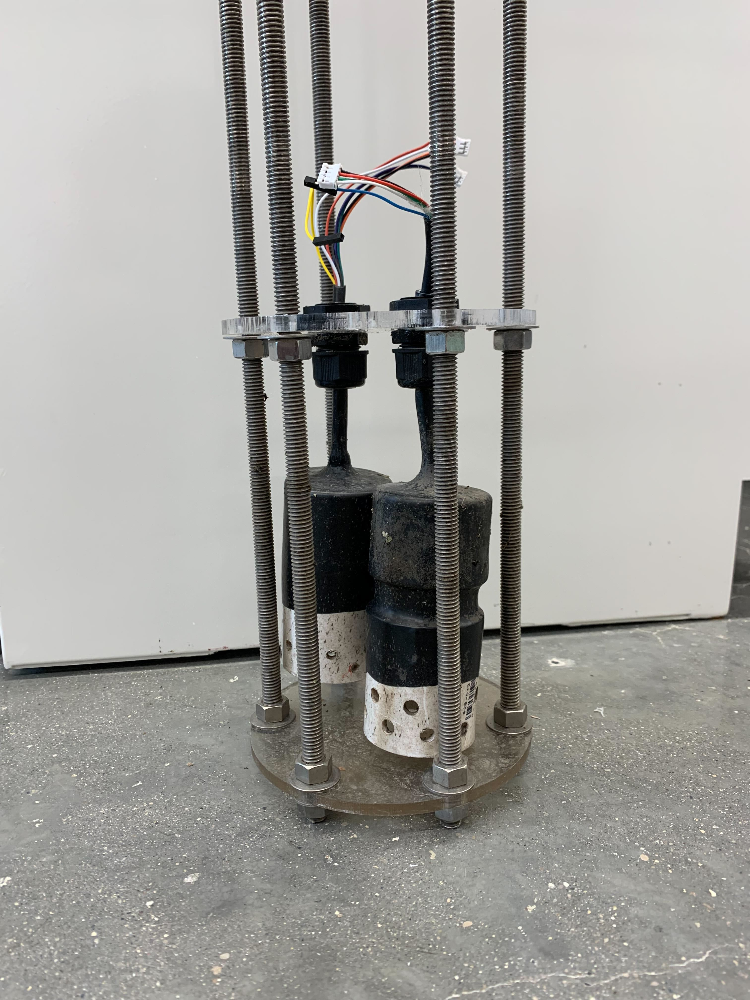
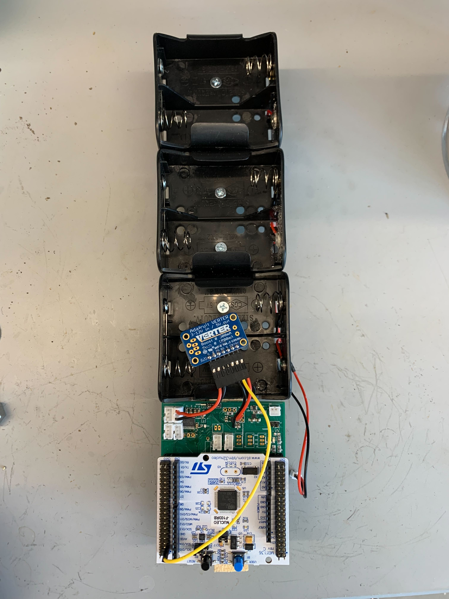
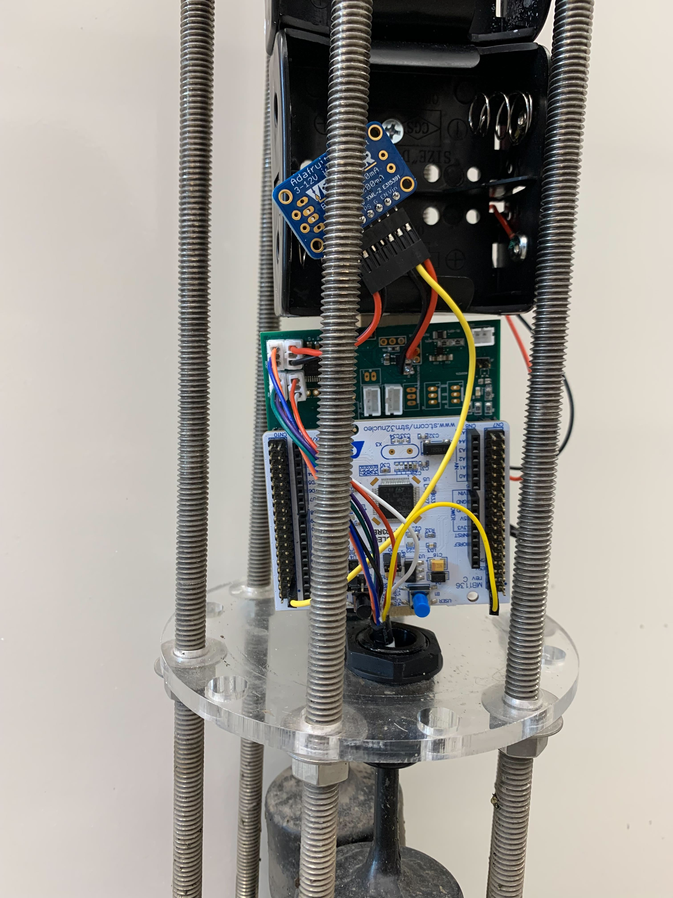
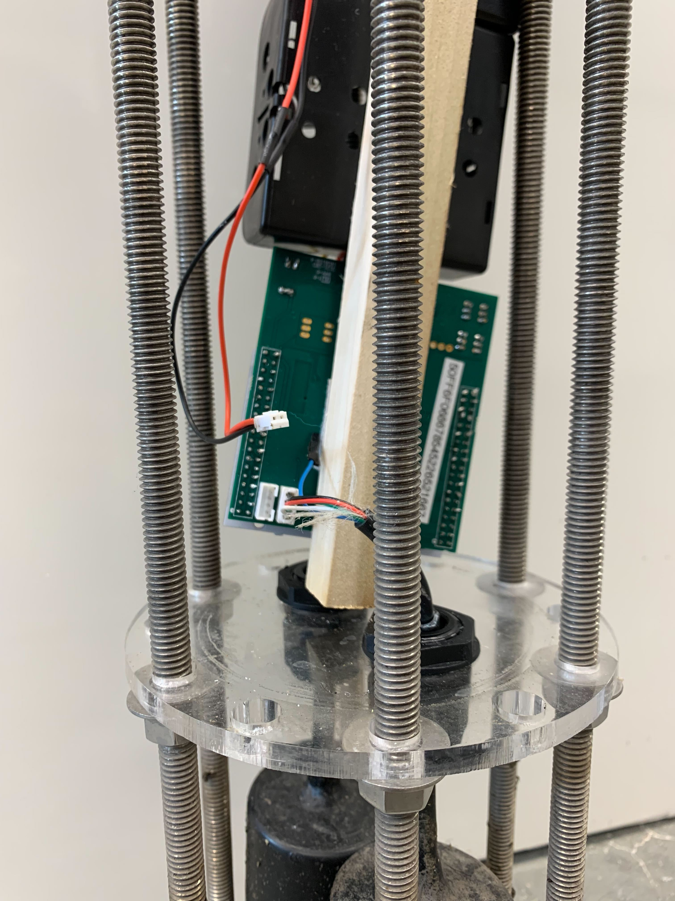
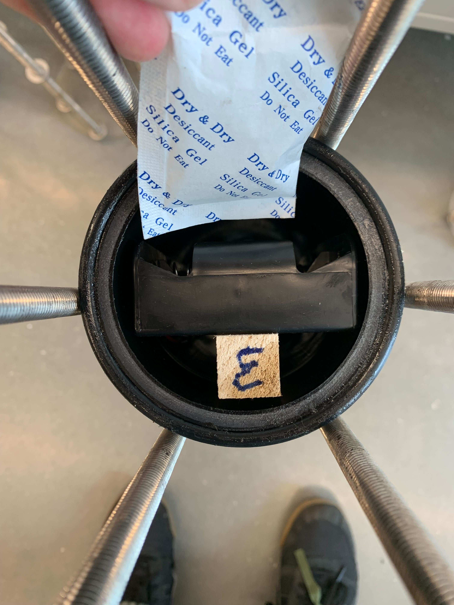
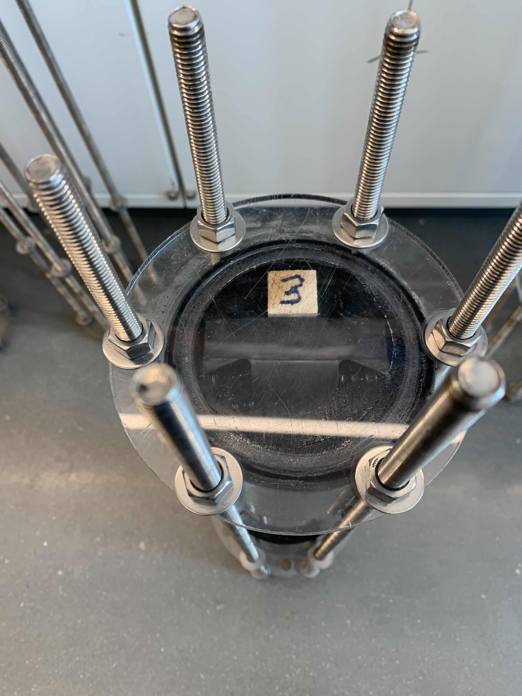

# RRIV Methane Beta Setup
## Overview
Beta version RRIV loggers with methane (CH<sub>4</sub>) and carbon dioxide (CO<sub>2</sub>). Methane sensors use a Figaro NGM2611-E13 metal oxide sensor and CO<sub>2</sub> sensors use a Atlas Scientific infrared carbon dioxide sensor. Sensors were encased in segments of 2" PVC pipe with one end covered by a 0.005" thick PTFE diaphragm to permit gas exchange with the water.

## Tools
* 2 adjustable wrench 3/8” to 1 ¼”
* Pliers 3/8” to 1 ¼”
* Mini USB to USB cable
* [Programming header](https://www.st.com/en/evaluation-tools/nucleo-f103rb.html) (Figure 1)
* ABS Rubber Cement
* [Molykote Grease](https://www.dupont.com/molykote.html)



*Figure 1: ST Nucleo programming header*

## Included components
* RRIV Data Logger (V0.21)
* [Enclosed CH<sub>4</sub> sensor]()
* Enclosed CO<sub>2</sub> sensor
* ABS sonde housing

## Off the shelf components to purchase
| Item | Number Needed per Device| Source & Part Number |
| ----------- | ----------- | ----------- |
| EPDM O-Ring (Size: Dash Number 341) | 2 | [McMaster-Carr 9557K316](https://www.mcmaster.com/9557K316/) |
| 18-8 stainless steel threaded rod 3/8” – 16 [2']   | 6 | [McMaster-Carr 98804A031](https://www.mcmaster.com/98804A031/) |
| 18-8 stainless steel hex nuts 3/8” -16 | 24 | [McMaster-Carr 91845A031](https://www.mcmaster.com/91845A031/) |
| 18-8 stainless steel washers 3/8” | 24 | [McMaster-Carr 92141A031](https://www.mcmaster.com/92141A031/) |
| Tenergy rechargeable NiMH D cell batteries | 6 | [Tenergy D Cell Batteries](https://power.tenergy.com/8pcs-tenergy-centura-lite-nimh-d-1-2v-3000mah-rechargeable-batteries/) |
| Tenergy NiMH D cell battery charger | 1 | [Tenergy Battery Charger](https://www.tenergy.com/01480) |
| Dupont jumper cables F-F | 5 | [Digikey 1528-1961-ND](https://www.digikey.com/en/products/detail/adafruit-industries-llc/1950/6827084) |
| Dupont jumper cables M-M | 3 | [Digikey 1568-1512-ND](https://www.digikey.com/en/products/detail/sparkfun-electronics/PRT-12795/5993860) |
| Copper Mesh Roll | 1 | [Home Depot](https://www.homedepot.com/p/Bird-B-Gone-Copper-Mesh-20-ft-Roll-for-Rodent-and-Bird-Control-CMS-20/205862497) |

## Initial sensor setup and configuration
* Install [Microsoft VS Code](https://code.visualstudio.com/) and then from within *VS Code* install the [PlatformIO extension](https://platformio.org/).
* Go to https://github.com/rrivirr/rriv and clone the repository there with github or download manually to a folder on your computer.
* Use dupont jumper cables to connect the programming board to the RRIV logger for communication following Figures 2 and 3.
* Connect the methane sensor plugs to the board as pictured in Figure 4. Plug the remaining 4-pin plug into the port on the back of the board.
* Plug the usb cable into the programming board and the computer your are using.
* Open VS Code and select the PlatformIO icon on the left side of the VS Code window. On the platformio home screen select `open project` and navigate to *folder* containing the RRIV repository you downloaded and select `open folder`.
* Now use the keys CTRL+SHIFT+P (macos: CMD+SHIFT+P) and type serial monitor.
	* This will present you with an option for `PlatformIO: Serial Monitor`.
	* While your computer is connected via USB to the RRIV logger is connected to a power source, select the `PlatformIO: Serial Monitor`. This will open a serial connection that will allow you to give commands to the RRIV logger.
* To learn more about the command line interface (CLI) and the commands available check RRIV documentation here or type `help` into the RRIV CLI command prompt and hit enter.
* To configure the sensor paste the following commands in the CLI one at a time (press enter after each command):<br>
&emsp;*Command for setting up sampling interval*:<br> ```set-config {"loggerName":"writeOnBoard", "siteName":"7char", "deploymentIdentifier":"15char", "wakeInterval":60, "startUpDelay":0, "burstNumber":60, "interBurstDelay":1}```<br>
&emsp;*Command that configures the humidity sensor integrated with the methane sensor:*<br>```set-slot-config {"slot":1, "type":"adafruit_dht22", "tag":"dht", "burst_size":10, "sensor_pin":5}```<br>
&emsp;*Command that configures the CO<sub>2</sub> sensor:*<br>```set-slot-config {"slot":2, "type":"atlas_co2", "tag":"atlas", "burst_size":10}```<br>
&emsp;*Command that configures the CH<sub>4</sub> sensor:*<br>```set-slot-config {"slot":3, "type":"generic_analog", "tag":"ch4", "burst_size":10, "adc_select":"external", "sensor_port":2}```

* To test the sensors type the command `start-logging` while the sensors are connected to the RRIV logger and press enter. This command will continuously report sensor values until you type `stop-logging`. Note: while the system is logging, values will continuously update sensor performance using the command start-logging. This means that when you are typing `stop-logging` the letters you type in will be broken up by new lines of data. The device will still read your typing as a single command so keep typing and press enter and the logger will stop.
* To beginning using the logger type `deploy-now` and press enter. Any time the logger is powered up after this it will immediately enter deployment mode after 5 seconds and begin collecting data following the configurations set above. Thus, you can keep the device powered down and add the batteries in the field immediately before deployment.



*Figure 2: RRIV Logger with the pins that are used to connect the programming board indicated by the orange box*

 The programming board connected to a RRIV logger using a set of five dupont jumper cables. b) a close-up of the programming board with the color of the jumper cable to be connected at each pin indicated.")

*Figure 3: a) The programming board connected to a RRIV logger using a set of five dupont jumper cables. b) a close-up of the programming board with the color of the jumper cable to be connected at each pin indicated.*

 ports.")

*Figure 4: Methane and humidity sensors plugged into the analog to digital converter (ADC) ports.*

## Commands for rapid configuration of a device
* `get-config` is used to check the configuration of the settings as they are, the first section displayed is the datalogger settings followed by sensor slot settings
* `set-config`
	* `loggerName` is a colloquial name that has been written on the back of the board in sharpie
	* `siteName` is a 7 character string to indicate where the RRIV is being deployed, this will also be used in the folder structure of CSV output, so should be unique
	* `deploymentIdentifier` is a 15 character string to indicate what experiment is being run
	* `wakeInterval` is in minutes and determines when the board wakes up to begin measurement cycles. 60 indicates to wake up every hour, 1 indicates every minute. The next interval is calculated at the end of a measurement cycle
	* `startUpDelay` is a duration in minutes to delay before starting the measurement cycle
	* `burstNumber` indicates how many burst cycles to complete during a measurement cycle
	* `interBurstDelay` now also works as an interval given in minutes for when to begin taking readings. 1 indicates to take readings at every minute
* example of set-config that will need to be customized
```
set-config {"loggerName":"writeOnBoard", "siteName":"7char", "deploymentIdentifier":"15char", "wakeInterval":1, "startUpDelay":0, "burstNumber":60, "interBurstDelay":1}
```

* `set-slot-config`:
	* `slot` is a digital slot of data set aside in the EEPROM to hold a sensor configuration
	* `type` is what driver type occupies the slot, these can be found by looking in the registry.cpp and following the "\_TYPE\_STRING" definitions
	* `tag` is a 5 character prefix for column headers, these should be left alone unless there are multiple of the same sensor in a system
	* `burst_size` is the number of reading cycles that should occur per burst
	* `sensor_pin` only for DHT22 currently, indicates which specific GPIO pin is being used for the sensor
	* `adc_select` only for analog sensors, can be either 'internal' or 'external' and indicates whether the analog sensor data is being processed by the ADC in the MCU or the external one
	* `sensor_port` only for analog sensors, indicates which physical port the sensor is occupying
* These can and should be used as they are to setup the AHT, CO2, and CH4 sensors, though once configured should be retained:
```
  set-slot-config {"slot":1, "type":"adafruit_dht22", "tag":"dht", "burst_size":10, "sensor_pin":5}
```
```
  set-slot-config {"slot":2, "type":"atlas_co2", "tag":"atlas", "burst_size":10}
```
```
  set-slot-config {"slot":3, "type":"generic_analog", "tag":"ch4", "burst_size":10, "adc_select":"external", "sensor_port":2}
```
* To check that all sensors are working properly use `start-logging` and when satisfied `stop-logging`
* If the DHT is showing errors restart the board using `restart` then try again
* If the serial is showing many I2C errors, disconnect the CO2 sensor and restart, if it is no longer showing I2C errors then manually switch the CO2 sensor from UART to I2C mode, if it is still showing I2C errors then unplug power and USB, hold reset button for a few seconds, then try again, or keep hitting the reset button until the errors clear
* To put the system in deployment mode use `deploy-now`, it will then go to sleep until the next wake interval

## Once the sensor has been deployed
* When the system has been recovered, if the system has been fully drained of power then disconnect the power source, if the system is still powered, hit the physical reset button (Black push button) before disconnecting power
* At this point you can remove the SD card and copy the data from it, then move folders into the oldData folder(we've been preserving old data on the SD cards for now), the file structure is `Data/{siteName}/epochTimestampAtFileCreation.CSV`
* Take the logger out of the case and connect the programming board to the device as described above (Figure 2)
* Open up the serial monitor in VS Code
* Power up the device with batteries or a wall outlet
* Once the device is fully booted up and you have reached the command prompt, you have 5 seconds to press the letter 'i' and then press enter. This puts the device back into interactive mode for further use

## Data
* The DHT22 reports temperature in degrees Celsius and relative humidity in percentage
* CO2 data is reported in ppm
* Methane data is reported as a digital reading, which can be converted to volts by `reading*5/4096` or millivolts `reading*5000/4096`, 5V being the voltage to the ADC and sensor, and 4096 being 2^12, which is the precision of the ADC

## Sonde assembly

*Figure 5: Assembly of the extended sensor housing*

* Part assembly: 
	* Use the ABS cement to secure the central housing ABS section into both the open sides of the couplers. Follow directions on the ABS cement to do so. Leave to cure in a ventilated space for 2hours
	* Apply a coat of Molykote 111 around the large O-rings and add them around the short sections of ABS in the couplers

### Case Assembly:
1. Add 2 nuts onto each of the 6 steel threaded rods, around 1" and 8" from the same end, then add washers to them one from each end of the rod.

2. Add the 6 rods through an acrylic end plate (does not have the holes for the cable glands / sensors) and affix each rod with another washer and nut.

3. Apply Molykote to the O-ring of the cable gland and attach with sensors through the sensor plate, hand tighten or use pliers. If the O-ring is displaced the it is too tight.

4. Rest the sensor plate on the open set of washers and visually level the nuts as best as possible, the goal is to keep the plate flat.

5. If deploying follow next steps, if doing a submersion test, proceed directly to sealing.

### Deploying:
1. Add RRIV board to battery assembly using Velcro.

2. Place board + battery assembly into center of rods, taking care to ensure no wires go around the rods. Then orient so that the dowel rod can sit flat on the acrylic plate and connect the sensors.


3. Set RRIV board to deployment mode by connecting to serial, checking sensors are working using `start-logging` (`stop-logging` when done checking), then using the command `deploy-now`.
4. Slide housing around the assembly, check for wires trapped underneath, mainly the blue wire of the CO2 sensor, then add dessicant pack in from the top.

5. Wrap copper mesh around the sensor cage and affix with cable ties.
6. Proceed to sealing

### Sealing:
1. Add top plate and hand tighten washers and nuts onto each rod.

2. Make one round of tightening the nuts in pairs across from each other using one or two sets of pliers, making ~180 degree turns and hand tightening the other nuts after each pair. 
3. Hand tighten the nuts on the sensor plate up towards the top plate, then repeat step 4.
4. Check each top nut by trying to make a 90 degree turn on each, they should all feel similarly tight.
5. Visually check the seal formed on the O-ring against the acrylic plate, you should not see the O-ring deform or have anything trapped underneath it, restart if you do.


*Figure 6: RRIV in extended sensor housing*

### Submersion tests (conducted without RRIV electronics in case):
* 30 minutes and 1 hour are good checking points for initial leaks. 24 hours for next day.
* In the event of a severe leak during testing, check sensor cases have not also flooded which can happen if the water traverses through the wires/cables of the sensor. If they have flooded, the PTFE should be cut to allow the case to drain, then dried; sensor cases can be remade if the sensors are still functioning. Otherwise, allow sensor cables to dry fully before using them.


*Submerge horizontally in a stock tank and weigh down the main housing to test the entire case*


*Submerge vertically in a 5gallon bucket to test just the sensor plate and cable glands*

<!--  -->


